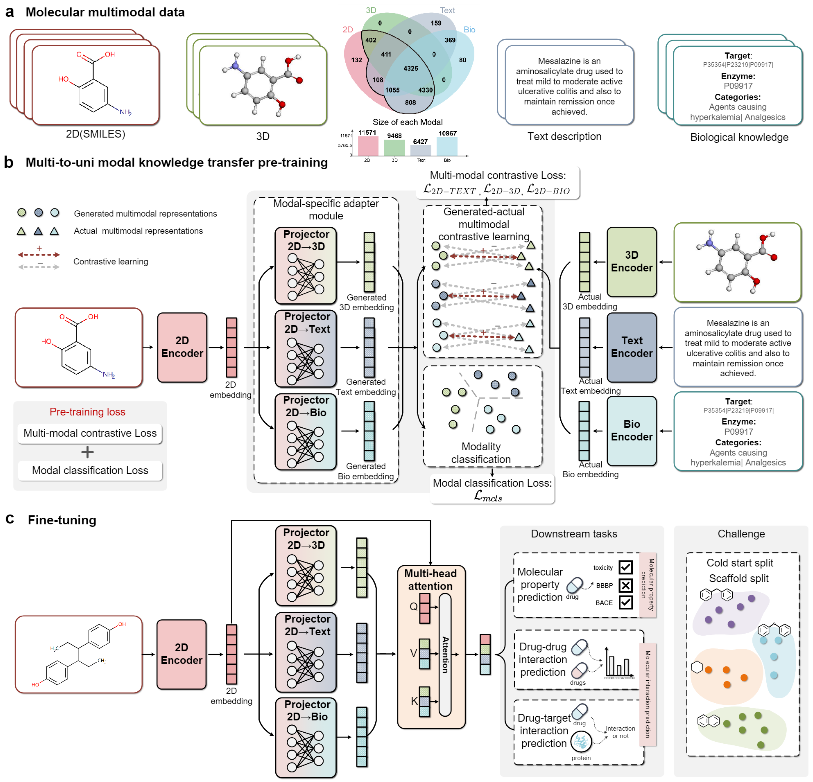

# M2UMol
Pre-training data, source code, and API for the paper "Multi-to-uni Modal Knowledge Transfer Pre-training for Molecular Representation Learning"


<p align="center">
   
</p>


## Table of Contents
 - [Environment](#Environment)
 - [Pretraining M2UMol](#Pretraining-M2UMol)
 - [Finetuning M2UMol](#Finetuning-on-three-tasks)
 - [Datasets](#Datasets)
 - [A Example of M2UMol as a molecular encoder](#A-Example-of-M2UMol-as-a-molecular-encoder)
 - [Molecular analysis API of M2UMol](#Molecular-analysis-API)
 - [Citation](#citation)

## Environment
First, install conda:
```
wget https://repo.anaconda.com/miniconda/Miniconda3-latest-Linux-x86_64.sh
bash Miniconda3-latest-Linux-x86_64.sh
```
Then create a virtual environment and install packages by using our provided `environment.yml`, and install torch-geometric
```
conda env create -f environment.yml
```
and install torch-geometric and additional dependencies
```
conda activate M2UMol
pip install torch_geometric
pip install pyg_lib torch_scatter torch_sparse torch_cluster torch_spline_conv -f https://data.pyg.org/whl/torch-2.0.0+cu117.html
```
## Pretraining M2UMol
You can first check the 'settings' in 'run_pretrain.py', and modify them according to your needs. You can also set parameters directly in the training command, for example:

```
python run_pretrain.py --num_layers 3 --lr 0.001 --batch 32 --epochs 150 --tem 1.0 --mcls_loss_ratio 0.5 --output_name M2UMol
```

For the Text encoder, we utlized a pre-trained large language model (LLM) PubMedBERT proposed by Microsoft. We download pre-trained PubMedBERT at [this Hugging Face link](https://huggingface.co/microsoft/BiomedNLP-BiomedBERT-base-uncased-abstract-fulltext/tree/main), and save them in a folder named 'pretrained-PubMedBERT'. For the 3D encoder, we utlized ComENet, a recently proposed method as the encoder, and implement it by using the [dive-into-graphs](https://github.com/divelab/DIG)

Note that the Text encoder and the 3D encoder are all further pre-trained in our pre-training phase, that is, the parameters of these models are not frozen. In addition, you can easily replace different large language models and 3D conformation encoders by modifying the parameters in 'layer.py'.

## Finetuning on three tasks
We comprehensively verified the model performance of M2UMol through three downstream tasks: molecular property prediction, drug-drug interaction prediction and drug-target interaction prediction.

### Molecular property prediction

### Drug-drug interaction prediction
For the drug-drug interaction prediction, you can use the following python script for training and testing for three times with three different seeds (for the cold start split setting, it means three different split):
```
python run.py
```
You can also set different parameters in 'run.py' or run for one time by the following python script:
```
python main.py --seed 0 --lr 0.0005 --batch 256 --weight_decay 0.0002 --dropout 0.7 --split scaffold
```
where '--split cold' and '--split scaffold' can choose the split settings, we provide both cold start split setting and scaffold split setting, which we used in our paper.

### Drug-target interaction prediction
For the drug-target interaction prediction, we utlized the framework of [DrugBAN](https://github.com/peizhenbai/DrugBAN) to evaluate the performances of M2UMol on the challenging cross-domain drug-target prediction tasks(named scaffold split setting in ou paper). Based on DrugBAN, we replace the molecular preprocessing procedure and the molecular encoder with our preprocessing procedure and M2UMol. You can use the following python script for training and testing for five times with five different seeds:
```
python run.py
```
You can also set different parameters in 'run.py' or run for one time by the following python script:
```
python main.py --cfg "configs/DrugBAN_DA.yaml" --data bindingdb --split "cluster" --seed 0
```
where '--cfg' is the config file of DrugBAN, for the scaffold split setting, we recommend using 'DrugBAN_DA.yaml'. '--data' can choose the DTI datasets, 'bindingdb' and 'biosnap' are available. '--split' can choose the split settings, 'random' and 'cluster' are available('cluster' denotes the scaffold split setting in our paper).

## Dataset

### Pre-training dataset
We constructed the [multimodal pre-training dataset]() based on [DrugBank](https://go.drugbank.com/). We first download the full data in XML format from [this link](https://go.drugbank.com/releases/latest#full), and filter out molecules which can not be converted to the 2D molecular graph by RDKit. Then we can download the structure data of molecules in [this link](https://go.drugbank.com/releases/latest#structures), and extract molecular 2D and 3D structure from these data in SDF format, which is the [2Dstructures.sdf] and the [3Dstructures.sdf], respectively. After that, we extract the textual description of molecules from the full data, which is the [description-sup.csv]. Finally we extract the targets and enzymes the molecules can interact/affect and the drug categories the molecules belong to, and obtain lists of all the occurring targets, enzymes and drug categories. For every molecule, we encode it using one-hot encoding based on its association with target, enzyme and drug categories.

### Fine-tuning datasets
#### Molecular property prediction
For the molecular property prediction, the datasets can obtained by the following python script:
```
wget http://snap.stanford.edu/gnn-pretrain/data/chem_dataset.zip
unzip chem_dataset.zip
```
Note that 


#### Drug-drug interaction prediction
For the drug-drug interaction prediction, we utilize the dataset from our previous work [MRCGNN](https://github.com/Zhankun-Xiong/MRCGNN), and applied cold start and scaffold split strategy to split the datasets, the details can be found in 'split.py'. After that, we obtain the DDI datasets in three folds(note that for the scaffold split setting, the training dataset and the test dataset are the same across three fold).

#### Drug-target interaction prediction
Since we used the DrugBAN framework for DTI prediction, the biosnap and BioSNAP datasets are downloaded in [DrugBAN datasets](https://github.com/peizhenbai/DrugBAN/tree/main/datasets). You can also find the data sources from [BindingDB](https://www.bindingdb.org/bind/index.jsp) and [BioSNAP](https://github.com/kexinhuang12345/MolTrans).


## A Example of M2UMol as a molecular encoder
For how to use M2UMol as a general molecular encoder, we present an example in [here]:
```python
from data_process import create_all_graph_data,construct_graph
from M2UMol import M2UMolencoder
import torch
smiles_list=['ClC1=CC2=C(NC(=O)CN=C2C2=CC=CC=C2Cl)C=C1']
graph=construct_graph(create_all_graph_data(smiles_list),0).to(device)
#Define M2UMol encoder
model=M2UMolencoder()
model.to(device)
model.eval()

#Load the pre-trained M2UMol model
model_dict = model.state_dict() 
pretrained_dict = torch.load('pre-trained_M2UMol.pt') 
pretrained_dict = {k: v for k, v in pretrained_dict.items() if k in model_dict}
model_dict.update(pretrained_dict)
model.load_state_dict(model_dict)  

representation2d,generated_3d,generated_text,generated_bio=model(graph)
print('final representation')
print(representation2d.cpu().detach().numpy())
```
The output is:
```python
final representation
[[-1.20773971e+00  9.97009516e-01  5.55726171e-01  2.88000011e+00 ... -6.52980864e-01 -8.60271811e-01  1.30764246e-01  2.13101649e+00]]
```
Our pre-trained M2UMol can  be easily used as a molecular encoder for a various molecular-related tasks, and because it is only a part of our pre-trained model, it is very efficient and lightweight for fine-tuning


## A Example of M2UMol as a molecular encoder


1.Learning drug structural features from drug molecular graphs, you need to change the path in 'drugfeature_fromMG.py' first. If you want use MRCGNN on your own dataset, please ensure the datas in 'trimnet' folds and the datas in 'codes for MRCGNN' folds are the same.)

```
python drugfeature_fromMG.py
```

2.Training/validating/testing for 5 times and get the average scores of multiple metrics.
```
python 5timesrun.py
```

3.You can see the final results of 5 runs in 'test.txt'
